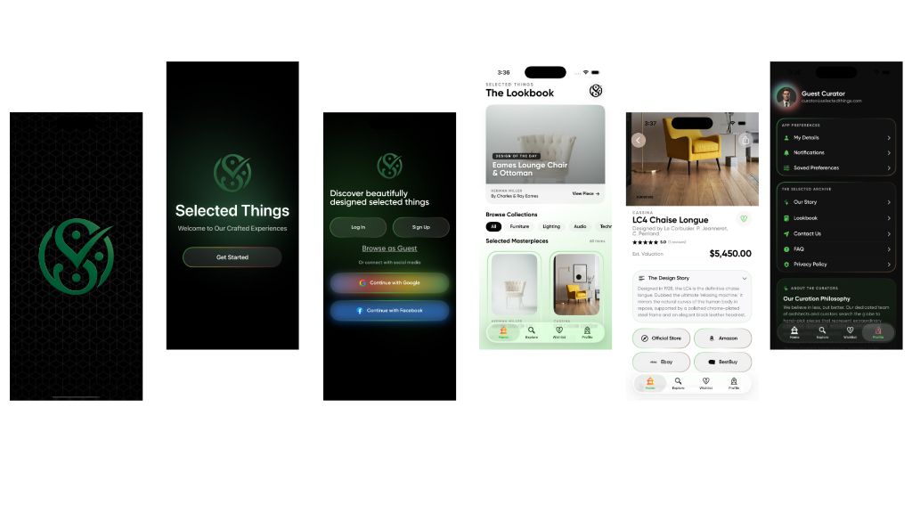

# The Selected Things

A premium, native iOS shopping application designed and built using **SwiftUI** and the **MVVM (Model-View-ViewModel)** architectural pattern. 

This project delivers a seamless, high-performance mobile commerce experience with state-of-the-art UI/UX, responsive layout aesthetics, and scalable engineering practices.

---

## 📱 Visual Preview



---

## 🚀 Key Features

* **Elegant UI/UX Design:** A modern look featuring fluid transitions, rich color schemes, dark-mode styling with continuous gradient backgrounds, and premium typography.
* **MVVM Architecture:** Clean separation of concerns ensuring a highly maintainable, testable, and robust codebase.
* **Product Discovery:** Intuitive browsing through curated categories, interactive product filters, and real-time search functionality.
* **Retail Partner Integration:** Built-in options to view and compare curated items on top-tier official partner stores (Amazon, eBay, Best Buy, and Google).
* **Advanced Cart Management:** Smooth local-to-remote cart persistence, item quantity adjustments, and dynamic total calculation.
* **Seamless Checkout & Curation:** Streamlined steps from shipping details selection, payment method assignment, promo code verification, to final order creation.
* **Comprehensive Account Hub:** Easy management of delivery addresses, user profile details, payment methods, order history tracking, and app notifications.

---

## 🆕 What's New in Version 0.5

* **Retail Partner Integration**: Integrated logos and deep-linking capabilities for Best Buy, eBay, Amazon, and Google.
* **Font Asset Reorganization**: Relocated and consolidated custom Gilroy fonts (`Gilroy-Bold.ttf`, `Gilroy-Medium.ttf`, `Gilroy-Regular.ttf`, `Gilroy-SemiBold.ttf`) into a dedicated `Font` folder.
* **Component Optimization**: Deprecated and purged legacy UI components (such as `AccountRow`, `CategoryCell`, `OTPTextField`, `RoundButton2`, `SectionTitleAll`, `TabButton`, `TextArea`) in favor of unified, highly-configurable modern alternatives.
* **Refined Navigation & User Flows**: Improved view transitions and updated screen layout architectures for `WelcomeView`, `SignInView`, `OTPView`, `HomeView`, `ExploreView`, `FavouriteView`, and various `Account` views.
* **Home & Review Consolidated**: Moved the `WriteReviewView` inside `View/Home` for unified feedback and review writing flows.

---

## 🛠️ Technology Stack & Architecture

* **UI Framework:** SwiftUI (Declarative UI)
* **Design Pattern:** MVVM (Model-View-ViewModel)
* **Language:** Swift 5+
* **Minimum iOS Target:** iOS 15.0+
* **Data Flow & Binding:** Swift State Objects (`@StateObject`, `@ObservedObject`, `@Published`)
* **Layout Design:** Custom layouts, standard grid lists, dynamic lists, and high-fidelity screen views.

---

## 👤 Author & Project Details

* **Developer:** Avinash Adhiraju
* **Project Name:** The Selected Things
* **Development Status:** Active / Production Ready
* **Current Version:** 0.5

---

## 📂 Project Structure

```
TheSelectedThings/
├── TheSelectedThings/       # Core App Source Code
│   ├── Assets.xcassets      # Design assets & icons
│   ├── Common/              # General helper extensions
│   ├── Font/                # Custom Gilroy fonts folder
│   ├── Model/               # Swift Data Models representing API schemas
│   ├── View/                # SwiftUI Views organized by feature
│   ├── ViewModel/           # ViewModels driving the dynamic UI states
│   └── UICommon/            # Reusable UI cells, input fields, and styles
├── TheSelectedThingsTests/   # Unit test suite
└── TheSelectedThingsUITests/ # Automated UI test suite
assets/                      # Public media assets (previews & icons)
```
